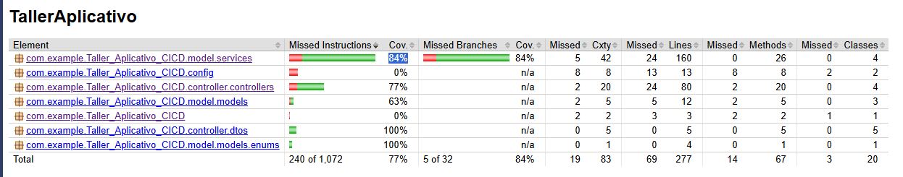

# Taller Aplicativo CICD

Aplicación de gestión de recetas desarrollada con Spring Boot y MongoDB, siguiendo una arquitectura de capas (controller-service-repository). La aplicación permite gestionar recetas de cocina con sus respectivos autores (chefs o participantes), ingredientes e instrucciones.

## Configuración Inicial con Spring Initializr

Este proyecto fue configurado utilizando [Spring Initializr](https://start.spring.io/) con las siguientes especificaciones:

### Configuración del Proyecto
- **Project**: Maven Project
- **Language**: Java 17
- **Spring Boot**: 3.x
- **Packaging**: Jar
- **Dependencias Principales**:
    - **Spring Web**: Para construir aplicaciones web, incluyendo RESTful, utilizando Spring MVC
    - **Spring Data MongoDB**: Para integración con base de datos MongoDB
    - **Lombok**: Para reducir código boilerplate con anotaciones
    - **Spring Boot DevTools**: Para desarrollo con reinicio automático
    - **Spring Boot Starter Validation**: Para validación de datos
    - **SpringDoc OpenAPI**: Para documentación automática de la API

### Estructura Inicial Generada
```
src/
├── main/
│   ├── java/
│   │   └── com/example/Taller_Aplicativo_CICD/
│   │       └── TallerAplicativoCicdApplication.java  # Clase principal
│   └── resources/
│       ├── static/                                   # Archivos estáticos (CSS, JS, imágenes)
│       ├── templates/                                # Plantillas de vista (si se usa MVC)
│       └── application.properties                    # Configuración de la aplicación
└── test/                                            # Pruebas unitarias y de integración
```

### Configuración Adicional
Después de la generación inicial, se realizaron las siguientes configuraciones adicionales:

1. **application.properties**:
    - Configuración de conexión a MongoDB
    - Configuración de logs
    - Configuración específica de la aplicación

2. **Dependencias Adicionales**:
    - Se agregó la dependencia de SpringDoc OpenAPI para documentación de la API
    - Se configuró Lombok en el IDE para evitar errores de compilación

3. **Estructura de Paquetes**:
    - Se organizaron los paquetes siguiendo la arquitectura por capas
    - Se agregaron los paquetes para controladores, servicios, modelos y repositorios

### Requisitos Previos
- Java 17 o superior
- Maven 3.6 o superior
- MongoDB instalado y en ejecución
- IDE compatible con Spring Boot (IntelliJ IDEA, VS Code, etc.)

### Ejecución del Proyecto
1. Clonar el repositorio
2. Asegurarse de que MongoDB esté en ejecución
3. Ejecutar la aplicación con Maven:
   ```bash
   mvn spring-boot:run
   ```
4. La aplicación estará disponible en: `http://localhost:8080`

---

## Estructura del Proyecto

El proyecto sigue una arquitectura por capas:

```
src/
├── main/
│   ├── java/
│   │   └── com/example/Taller_Aplicativo_CICD/
│   │       ├── controller/           # Controladores REST
│   │       │   ├── controllers/      
│   │       │   └── dtos/             # Objetos de Transferencia de Datos
│   │       ├── model/
│   │       │   ├── models/           # Entidades del dominio
│   │       │   ├── repositories/     # Repositorios de datos
│   │       │   └── services/         # Lógica de negocio
│   └── resources/                    # Configuraciones y recursos
```
## Componentes Principales

### 1. RecipeController

Controlador REST que expone los siguientes endpoints:

- `POST /recipe` - Crea una nueva receta
- `GET /recipe/participant/{authorName}` - Obtiene receta por nombre de participante
- `GET /recipe/chef/{chefName}` - Obtiene receta por nombre de chef
- `GET /recipe/viewer/{viewerName}` - Obtiene receta por nombre de espectador
- `GET /recipe` - Obtiene todas las recetas
- `GET /recipe/number/{number}` - Obtiene receta por número
- `GET /recipe/season/{season}` - Obtiene recetas por temporada
- `GET /recipe/ingredient/{ingredient}` - Obtiene recetas por ingrediente
- `PUT /recipe/{id}` - Actualiza una receta existente
- `DELETE /recipe/{id}` - Elimina una receta

### 2. RecipeService

Implementa la lógica de negocio principal:

- **Gestión de recetas**: Creación, actualización y eliminación
- **Búsquedas complejas**: Por autor, ingrediente, temporada, etc.
- **Validaciones**: Verificación de existencia de autores (chefs/participantes)
- **Asignación automática** de números de receta secuenciales
- **Transformación** entre DTOs y entidades

### 3. RecipeRepository

Interfaz que extiende `MongoRepository` para operaciones CRUD con MongoDB:

- Búsqueda por autor
- Búsqueda por número de receta
- Búsqueda por ingrediente (usando consultas personalizadas con `@Query`)

## Flujo de Datos

1. **Cliente** → Realiza peticiones HTTP al controlador
2. **Controlador** → Valida la entrada y delega a los servicios
3. **Servicio** → Aplica lógica de negocio y se comunica con el repositorio
4. **Repositorio** → Interactúa con la base de datos MongoDB
5. **Base de Datos** → Almacena los datos de forma persistente

## Modelo de Datos

### Entidad Principal: Recipe
- `id`: Identificador único (UUID)
- `title`: Título de la receta
- `author`: Nombre del autor (chef o participante)
- `num`: Número secuencial de receta
- `ingredients`: Lista de ingredientes
- `instructions`: Lista de instrucciones/pasos

## Configuración

1. Clonar el repositorio
2. Asegurarse de que MongoDB esté en ejecución
3. Configurar la conexión a MongoDB en `application.properties`
4. Ejecutar la aplicación con Maven: `mvn spring-boot:run`

## Documentación de la API

La documentación de la API está disponible en formato OpenAPI/Swagger en:
- `/swagger-ui.html` - Interfaz gráfica
- `/v3/api-docs` - Especificación OpenAPI en formato JSON

## Pruebas con jacoco


#### Configuración del Workflow CI/CD

El proyecto utiliza GitHub Actions para la integración y despliegue continuos. El flujo de trabajo se define en `.github/workflows/build.yml` y realiza las siguientes acciones:

1. **Build y Pruebas**:
    - Configuración de Java 17
    - Caché de dependencias de Maven
    - Ejecución de pruebas unitarias y de integración
    - Generación de informe de cobertura con JaCoCo
    - Verificación de umbrales de cobertura

2. **Despliegue**:
    - Construcción del archivo JAR ejecutable
    - Despliegue automático a la plataforma en la nube
    - Notificaciones de estado del despliegue

## Estado del Despliegue

La aplicación web estaba desplegada en azure, pero actualmente se encuentra no disponible debido a que se agotaron los créditos de la cuenta. La URL de la aplicación era:

```
https://tallercicd-f8d6c7btbagsf4hk.canadacentral-01.azurewebsites.net/swagger-ui.html
```

